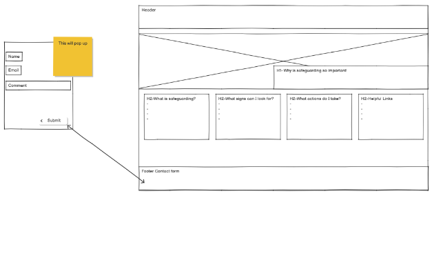
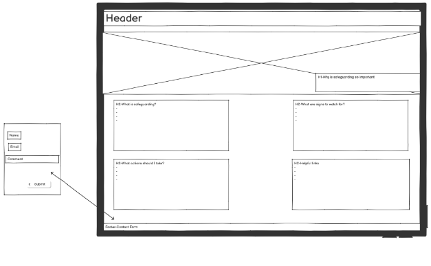
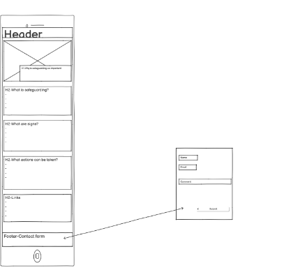

Read me 

Name: Grace Johnson-Safeguarding 

 

Description: 

This project shows some important information on safeguarding.  

It looks at What is safeguarding, What signs people can look for, Actions people can take and some helpful links to other websites.  

This page is the home page and the minimal viable product. It can be expanded and built on at later dates.  

It has a contact page so users can communicate/ get in contact. 

 

Features: 

The project is build-up of 4 main sections: header, hero, main and footer.  

Header 

The header section has a navigation bar that displays the word home. The home works as a button and works to return to this first page.  

On a small screen you will then see a drop-down subject selection. This is to make it easier to find information on the page instead of having to scroll through it all. 

Hero 

The hero section displays and image of clay people standing together with a slogan expressing the key principle of safeguarding. 

Main 

There are 5 information cards in the main area which display a question then information under neath. Some are in unorder lists some in just a paragraph. 

The links area and get in contact all have working and tested links that are highlighted by being underlined and a different colour.  

The contact card is working and will send the user to a contact page where there is a form to fill out with email and comment.  

The form is a clear simple layout which sits in a box onto of a photo of paper people in a circle of hands. 

Footer 

The footer displays the copyright and links to Facebook and twitter. The href links are there ready to fill but are not linked to anything as of yet. 

 

UX/UI 

This site is a minimally yet effective site to allow someone to access information on safeguarding. It defines what safeguarding is, what signs of abuse or neglect they could look for, actions they can take, useful information they can access to gather more information and a place to get in contact if there are further enquiries. 

This site is clearly laid out with 5 cards on information. The colour red was used as a colour theme because it is a colour usually associated with danger and because this site is talking about protecting people who may be in danger or harm's way the colour theme fits appropriately. 

Wire frames 

User stories 

I want to be able to contact someone 

I want to access a reliable and easy-to-understand website 

I want to be able to find more information if I want to read more 

I want the site to inform me what safeguarding is and how I can help someone I'm concerned about. 

Testing 

There have been multiple tests take to make sure this site is bug free and working. 

Tests taken out by the site coder. 

Feature: Nav bar drop-down 
Location:On the top right corner when on a small screen 
Expectation:It drops down 
Pass 

Feature: Drop-down options
Location: On the top right corner when on a small screen after clicking for menu to drop down. 
Expectation:They take you to that part of the page. 
Pass 

Feature: Home
Location: Top Left hand of page in nav bar 
Expectation: It takes you back to the index.html page 
Pass 

Feature: Links
Location: In the Links section under the title Useful Information 
Expectation: They take you to the correct desired external website 
Pass 
Notes:Would be nicer if it then opened in a new tab 

Feature: Contact us button
Location: In the get in contact section at the bottom of the page just above the footer 
Expecation: Takes you to the Contact Page 
Pass 

Feature: The send button
Location: On the contact page under the input section 
Expectation: Sends the message as an email to the right person 
Fail 
Notes:This is not yet set up. 

 
All HTML code has also been copied and checked on: https://validator.w3.org/nu/ 

No bugs or problems were highlighted 

All CSS has been copied and tested at: https://jigsaw.w3.org/css-validator/ 

No bug or problems were highlighted 

 
Deployment 

This site was deployed to GitHub pages. The way of deployment are as follows: 

Go to your GitHub repository then go to settings. 

Once on settings on the left hand of the page scroll to pages under the code and automation section  

Once you have clicked on pages. On the main screen under branches, you will see a drop down. Cange it from None to Main. 

You will then notice next to it the drop-down options are /(root) or /docs. 

Make sure you have selected /(root) then click save. 

The live link can be found here: https://gracey46.github.io/Safeguarding/ 

 

 

Credits 

During this project there are multiple sources used to have the end result.  

Content: 

Grace Johnson-Love running project (https://gracey46.github.io/love-running/) was used to make the header and dropdown nav bar. 

https://www.easternbaptist.org.uk/safeguarding/safeguarding-training/  Was the source of the hero image 

Bootstrap was used to make the grid system and design for the information cards 

Bookstrap was used to make the contact form. 
1[contact-image](assets/images/contact-image2.png)
https://www.dental-nursing.co.uk/features/safeguarding-children-and-young-people Was the source of the background image. 

The external links are: 

NSPCC Learning about safeguarding children https://learning.nspcc.org.uk/safeguarding-child-protection" 

Social Care Institute for excellence https://www.scie.org.uk/safeguarding/adults/introduction/what-is/ 

Govenment Safeguarding District Provision Tool https://www.gov.uk/guidance/district-provision-tool/safeguarding 

Safeguarding Vulnerable Groups Act 2006 https://www.legislation.gov.uk/ukpga/2006/47/contents 
 
Fontawesome was used for the footer Icons.

Feature left to implement. 

In future releases it would be more insightful to have more information, and the information have a read more button that takes you to a page with more detailed information for that section instead of having such concise bits of information this is due to the length of time had for this project.  

The send button on the contact form to send the information that is filled out to be sent to someone this is due to not having a location for the messages to be sent.  

There to be pages in twitter and Facebook for them to be linked to and fully work this is due to not having those social media pages. 

Summary 

In conclusion this is a minimal viable product to inform people on the basics of safeguarding. It is simply and effectively displayed for all devices. The navigation bar may be beneficial if it would be added to a medium screen as well as a small screen.  

The design did differ from the wireframe in some areas: 1st area is the contact button not being in the footer. I did not feel this was the correct place for it to sit. 2nd The contact form was its own standing page and not a pop out that's due to the timeframe and that making a new page that is linked was less time consuming. 

All links and pages work although when clicking on a link to an external page it would be nice if they opened in a new tab keeping the website open for easy access to return to the original page. 

All code has been checked tested, and no bugs are currently displaying themselves.  

Throughout this project AI was used to aid code and concise information. This was a helpful resource leading concise information and time saved on parts of code.  

Using AI is a helpful tool however it was not used extensively in this project. 